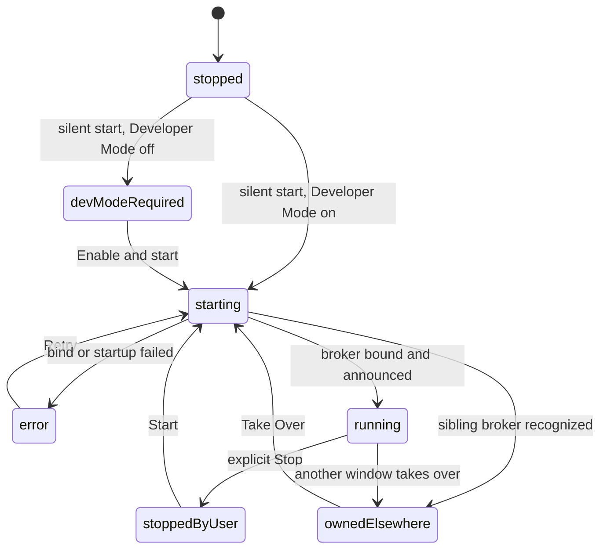
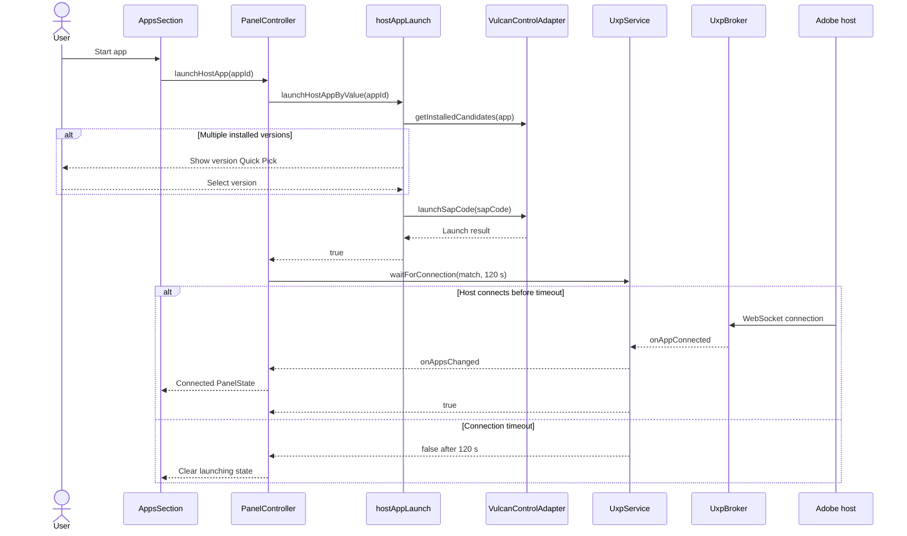

# Adobe App Discovery and Launch

Current-state documentation for automatic Adobe host discovery, broker startup,
application status in the control panel, and manual host launch.

The main implementation points are:

- [`UxpService`](../src/vscode/UxpService.ts) owns broker lifecycle and the
  silent and interactive startup paths.
- [`extension.ts`](../src/vscode/extension.ts) starts discovery during
  extension activation.
- [`PanelController`](../src/vscode/panel/PanelController.ts) builds panel
  state and handles app launch actions.
- [`AppsSection`](../src/vscode/panel/webview/AppsSection.tsx) renders the
  static host catalog with live connection and installation state.
- [`hostAppLaunch.ts`](../src/vscode/commands/hostAppLaunch.ts) owns installed
  version selection and Vulcan launch behavior.

## 1. Startup behavior

Discovery starts automatically during extension activation. After takeover
teardown and broker HTTP handlers are wired, `extension.ts` calls
`UxpService.startDiscoverySilently()` without awaiting it. Activation is not
blocked, and an unexpected rejection is written to the UXP Debugger output
channel.

The silent path never opens a dialog:

1. If the broker is already running, starting, or known to be owned by another
   window, the call is a no-op.
2. If Adobe Developer Mode is disabled, the service enters
   `devModeRequired` without invoking the elevation flow.
3. Otherwise it creates the broker, attempts to bind `127.0.0.1:14001`, and
   announces it through Vulcan.
4. A recognized UXP Debugger broker on that port produces `ownedElsewhere`.
5. A foreign port owner or another startup failure produces `error` and stores
   a human-readable `brokerError`.

Interactive commands continue to call `UxpService.ensureStarted()`. That path
may show the Developer Mode consent/elevation UI, offer takeover of another
UXP Debugger window, or show the ordinary port-in-use Retry/Cancel dialog.
The panel's **Enable & start**, **Retry**, and explicit **Start** actions use
this same interactive path.

### Developer Mode

The broker reads Adobe's machine-wide Developer Mode setting directly from:

- Windows: `%CommonProgramFiles%\Adobe\UXP\Developer\settings.json`
- macOS: `/Library/Application Support/Adobe/UXP/Developer/settings.json`

Reading and parsing this file does not require elevation. Enabling Developer
Mode does: after explicit consent, the extension invokes its packaged
`win32.bat` through elevated PowerShell or `mac.sh` through `osascript`, then
reads the file again to verify the change. Declining or failing elevation
leaves the broker stopped. Silent activation only detects the setting and
never invokes this flow.

## 2. Broker state

`UxpService.brokerState` and `BrokerStatus` expose these states:

| State | Meaning | Panel behavior |
| --- | --- | --- |
| `stopped` | Initial or transient idle state. | No banner. |
| `starting` | Silent or interactive startup is in progress. | Shows "Looking for Adobe apps...". |
| `devModeRequired` | Silent startup found Developer Mode disabled. | Shows **Enable & start**. |
| `running` | This window owns the broker. Connected apps may still be empty. | No status banner; app rows carry connection state. |
| `ownedElsewhere` | Another VS Code window owns the broker. | Blocks the panel with an explicit **Take Over** action. |
| `stoppedByUser` | The user explicitly stopped this window's broker. | Blocks the panel with an explicit **Start** action. |
| `error` | Silent startup failed, for example because a foreign process owns port 14001. | Shows the error and **Retry**. |

There are no separate `listening` and `connected` broker states. Connection
is represented independently by `UxpService.connectedApps`, and app connect
or disconnect events trigger a fresh panel snapshot.

## 3. Application catalog and panel state

The Apps section renders every entry in `HOST_APPS` from
[`hostAppCatalog.ts`](../src/core/vulcan/hostAppCatalog.ts). The current
catalog contains:

| App | Manifest id | SAP channels |
| --- | --- | --- |
| Photoshop | `PS` | `PHSP`, `PHSPBETA` |
| InDesign | `ID` | `IDSN`, `IDSNBETA` |
| Premiere Pro | `premierepro` | `PPRO`, `PPROBETA` |

Adobe XD is not in the current catalog.

`PanelController.buildState()` passes three independent app facts to the
webview:

- `connectedApps`: live broker connections, including host version, UXP
  version, and script-debugging support;
- `installedApps`: catalog app ids with at least one detected installed
  candidate;
- `launchingApps`: app ids whose panel launch action is still busy.

Installed-app detection calls `getInstalledCandidates()` once per catalog
entry and caches the resulting ids for the lifetime of the VS Code window.
When the native adapter is unavailable, `installedApps` is `undefined`; the
panel leaves Start enabled instead of claiming that the app is not installed.

Each app row displays one of these states:

| State | Display and action |
| --- | --- |
| Connected | Connected app name, app version, and UXP version; no Start button. |
| Launching | Spinner and "starting..."; no Start button. |
| Known not installed | "not installed"; Start is disabled with a tooltip. |
| Not connected | "not connected" and an enabled **Start...** button. |

The catalog is rendered whenever the Apps section is expanded. Broker
ownership states may place a blocking overlay over the whole panel.

## 4. Manual launch

The `launchHostApp` panel action is serialized by the standard busy-row key
`app:<appId>`, so repeated clicks for one app are ignored while that launch is
active. Different app rows can launch independently.

`launchHostAppByValue()` performs the launch:

1. Resolve the id through `HOST_APPS`.
2. Query installed candidates across the app's SAP channels.
3. Automatically use the sole candidate or show a Quick Pick when several
   versions are installed.
4. Call `IHostAppController.launchSapCode()` for the selected candidate.
5. Show a VS Code information notification after a successful launch.

Unknown ids, unavailable native detection, no installed candidates, and a
failed launch are reported with VS Code notifications. They are not stored as
inline per-row error state.

After a successful launch call, `PanelController` keeps the row busy while
`UxpService.waitForConnection()` waits up to `CONNECT_TIMEOUT_MS`, currently
120 seconds, for a matching `connectedApps` entry. The panel launch path does
not show a progress notification and does not apply the additional post-connect
settle delay used by plugin loading. If the wait expires, the spinner clears
and the row returns to "not connected"; there is currently no dedicated
timeout warning from this panel path.

The plugin-load recovery flow is related but intentionally different.
`resolveHostAppNotRunning()` can offer a launch, displays cancellable
notification progress while waiting, and waits an additional three seconds
after connection before retrying `Plugin/load`. If an app process is already
running but has not connected, that flow falls back to its Retry dialog.

## 5. Multi-window behavior

Silent activation never takes ownership from another window. If the identity
probe recognizes another UXP Debugger broker, this window enters
`ownedElsewhere` and the panel becomes non-interactive behind a takeover
overlay.

The overlay's **Take Over** button is itself the confirmation. It calls
`UxpService.takeOverFromPanel()`, requests shutdown from the current owner,
and then performs a fresh silent bind attempt. Command Palette and debug entry
points retain the modal takeover confirmation used by `ensureStarted()`.

See [`MULTI-WINDOW-TAKEOVER.md`](MULTI-WINDOW-TAKEOVER.md) for teardown,
port-release ordering, and native-adapter lifetime details.

## 6. Failure behavior and limitations

- Automatic startup never prompts or elevates.
- A foreign listener on port 14001 becomes panel state `error`; Retry enters
  the interactive startup flow.
- Application installation detection is cached per VS Code window and is not
  refreshed after installing or removing a host app.
- Installation detection currently disables Start for confirmed missing apps;
  it does not retain a per-row launch error.
- The panel launch wait only observes broker connection. It does not guarantee
  that a newly connected host is ready for plugin operations.
- Beta SAP codes for hosts other than Photoshop remain unverified assumptions
  in the catalog.

## 7. Verification

Automated coverage includes panel-state propagation and broker ownership
behavior, while complete discovery and launch behavior depends on the native
Vulcan adapter and a real Adobe host.

Useful manual checks are:

1. Activate with Developer Mode enabled and a host already running; its row
   should become connected without a plugin action.
2. Activate with Developer Mode disabled; no elevation prompt should appear,
   and **Enable & start** should be available.
3. Open a second VS Code window while the first owns the broker; the second
   should show the takeover overlay without an automatic prompt.
4. Occupy port 14001 with a foreign process; silent startup should show an
   actionable error without an unhandled rejection.
5. Start an installed app from its row; the row should remain busy until the
   app connects or the 120-second wait ends.
