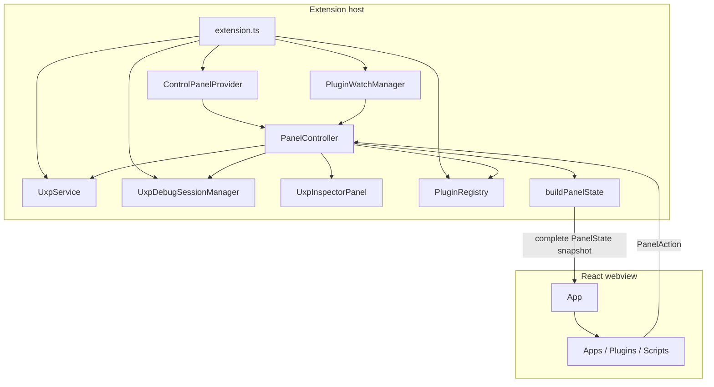

# UXP Debugger Control Panel

Current-state documentation for the **UXP Devtools** sidebar panel.

The panel is the primary day-to-day UI for registering UXP plugins and scripts, starting
Adobe applications, loading and debugging plugins, inspecting HTML/CSS, watching files,
and creating `.ccx` installers. Command Palette commands and `launch.json` configurations
remain available and use the same underlying services.

Application discovery and launch are documented in
[`APP-DISCOVERY.md`](APP-DISCOVERY.md). Agent-facing equivalents of panel operations are
documented in [`LANGUAGE-MODEL-TOOLS.md`](LANGUAGE-MODEL-TOOLS.md).

---

## 1. Entry point and layout

The extension contributes one Activity Bar container named **UXP Devtools** and one
`WebviewView` with id `uxp.controlPanel`. The view is implemented by
[`ControlPanelProvider`](../src/vscode/panel/ControlPanelProvider.ts), while the React
application lives under [`src/vscode/panel/webview/`](../src/vscode/panel/webview/).

The view contains three collapsible sections:

1. **Apps** — known Adobe host applications and their connection state.
2. **Plugins** — a flat global list of registered `manifest.json` files.
3. **Scripts** — a flat global list of registered UXP scripts.

There is no project container or nested project-to-plugin hierarchy. A plugin can be used
regardless of whether its directory is part of the current workspace. Paths inside an open
workspace are highlighted, and the row associated with the active editor is highlighted.

The view title contributes these commands:

- **Configure launch.json**
- **Enable/Disable Compact View**
- **Start/Stop UXP Devtools**

Compact view hides secondary row details. Section collapse state is local to the webview
and survives view recreation through `vscode.getState()` / `vscode.setState()`; compact
view is persisted globally in the registry.

All controls use real buttons, VS Code codicons, `aria` labels, tooltips, and VS Code theme
variables. The layout is designed for a narrow sidebar rather than a table.

---

## 2. Apps section

The Apps section renders the static host catalog from
[`hostAppCatalog.ts`](../src/core/vulcan/hostAppCatalog.ts). Each row reports one of:

- connected, including app version and UXP runtime version;
- starting;
- not connected;
- not installed, when native installation detection is available.

The **Start...** action is available for a non-connected app. It reuses the native
installed-version picker and remains busy until that app connects or the connection wait
times out. When installation detection is unavailable, the panel leaves Start enabled
instead of assuming that no application is installed.

Plugin host badges use the same launch flow. A connected badge remains clickable so that
another installed version can be launched.

### 2.1 Broker states

The authoritative state definitions, panel rendering, and state diagram are in
[`APP-DISCOVERY.md`](APP-DISCOVERY.md#2-broker-state). The panel-specific takeover action
and its single-confirmation behavior are documented with the ownership protocol in
[`MULTI-WINDOW-TAKEOVER.md`](MULTI-WINDOW-TAKEOVER.md#41-control-panel).

---

## 3. Plugins section

Each plugin row is derived from the registered manifest and live session state. It shows:

- manifest name and plugin id;
- host-app badges from the manifest;
- the plugin directory, with the matching workspace prefix highlighted;
- manifest errors without removing the row;
- loaded, debugging, or break-on-start pending status;
- whether an inspector is open and whether Watch is enabled;
- a spinner while a row action is in flight.

The section header contains **Break on load** and an add menu. Plugins can be added by
selecting a `manifest.json` or by registering the active editor when it is a manifest.
Registration validates the manifest and rejects duplicate paths.

### 3.1 Plugin actions

| Action | Behavior |
| --- | --- |
| **Load** | Uses the shared load flow, including host selection, app launch, developer-mode, timeout, and takeover dialogs. |
| **Load (break on load)** | Loads the plugin paused and records each new session as waiting for its first debugger attach. |
| **Unload** | Unloads every live session associated with the manifest. |
| **Debug** | Uses the shared attach flow and can offer to load an unloaded plugin first. |
| **Stop debugging** | Stops all attached VS Code debug sessions for the manifest. |
| **Open HTML/CSS inspector** | Opens an inspector for the only live session, or asks which session to inspect when several exist. |
| **Close inspector** | Closes inspectors belonging to all sessions for the manifest. |
| **Refresh** | Sends the in-place `Plugin/reload` request to every live session. An attached debugger survives. |
| **Reload** | Unloads and loads again in the same host app, then restores the debugger and inspector when possible. |
| **Watch / Unwatch** | Persists watch mode. It becomes active while the plugin is loaded. |
| **Create installer...** | Validates the manifest, asks for a `.ccx` destination, and packages the plugin directory. |
| **Open folder...** | Selects an ancestor directory, then opens it in this window, adds it to the workspace, or opens it in a new window. |
| **Open manifest.json** | Opens the registered manifest in a non-preview editor. |
| **Remove** | Removes the entry immediately and offers **Undo** in a native notification. Files are never deleted. |

A manifest error disables operations that need a valid manifest, but folder, file, and
remove operations remain available.

### 3.2 Refresh versus reload

**Refresh** calls the UXP `Plugin/reload` wire command and keeps the existing session.
**Reload** performs a full unload/load cycle. Before unloading, the controller records
whether any associated session has a debugger or inspector. It pins the load to the
previous host app, attaches the debugger again, and reopens the inspector after a
successful load.

When break-on-load is enabled and the previous session had an inspector but no debugger,
the inspector cannot be restored because the new session has no execution context yet.
The panel logs that case and waits for the user to attach the debugger. If loading is
cancelled or fails, no state is restored.

### 3.3 Opening a plugin folder

The folder picker walks from the plugin directory toward the filesystem root and stops
after the first directory containing `.git`. It recommends the most deeply nested
candidate containing `.git`, then `.vscode`, then `src`, falling back to the plugin
directory.

Opening in the current window requires confirmation because it replaces the workspace.
Before the switch, the extension closes all inspectors and stops its debug sessions.
Adding a folder to the workspace and opening it in a new window do not tear down the
current window.

---

## 4. Scripts section

Supported script extensions are `.ccjs`, `.psjs`, `.idjs`, `.js`, and `.ts`. The host
badge is inferred from the extension: `.psjs` maps to `PS`, `.idjs` to `ID`, and all
other supported extensions to `ANY`.

The section header provides a target-app selector populated from connected applications.
Applications that do not advertise script-debugging support remain visible but disabled.
The saved target remains visible as "not connected" when that app disconnects.

Scripts can be added with a file picker, from the active editor, or from the active editor
and debugged immediately. A dirty active document is saved before it is registered and
run. Missing files remain visible with a warning; run, watch, and open actions are disabled.

### 4.1 Script actions

| Action | Behavior |
| --- | --- |
| **Run & debug** | Runs the script in the selected target app and attaches the debugger. |
| **Stop debugging** | Stops attached debug sessions associated with the original script path. |
| **Watch / Unwatch** | Persists watch mode. It becomes active while the script is being debugged. |
| **Open file** | Opens the script in a non-preview editor. |
| **Pass arguments...** | Edits and validates the stored comma-separated JSON values. |
| **Remove** | Removes the entry and offers **Undo**. The source file is not deleted. |

Panel-initiated script runs never prompt for arguments. The Args input accepts values such
as `2, "text", true`; an empty string means no arguments. The raw text is stored per script,
parsed before every run, and reused by Watch restarts. `launch.json` runs remain independent
and use their own `userArgs` property.

UXP has no unload-script request, so script status is based on an attached debugger rather
than the continued existence of a broker-side script session.

For a `.ts` script, the extension strips types into a temporary `.js` file while preserving
line and column positions for debugging. This is type erasure rather than compilation or
bundling: imports and multi-file programs still need a build tool, and syntax with runtime
semantics such as value enums, parameter properties, code-emitting namespaces, and legacy
decorators is rejected. Temporary generated files are removed when the session or extension
ends.

---

## 5. Watch mode

[`PluginWatchManager`](../src/vscode/panel/PluginWatchManager.ts) reconciles filesystem
watchers whenever registry, broker-session, or VS Code debug-session state changes.
Changes are debounced for 350 ms.

A watched plugin has an active recursive watcher only while at least one of its sessions
is loaded:

- a change to `manifest.json`, any `.uxpaddon`, or a manifest-declared icon triggers a
  full Reload;
- every other changed file triggers an in-place Refresh;
- icon matching recognizes `@2x` and `@3x` on-disk variants of manifest icon paths;
- all paths changed during one debounce window are classified as a single batch.

A watched script has a single-file watcher only while a debugger is attached. A change
stops and reruns the script with its stored target app and arguments. A watcher is removed
as soon as its plugin is unloaded, its script debugger stops, Watch is disabled, or the
registry entry is removed.

---

## 6. State and persistence

[`PluginRegistry`](../src/vscode/panel/PluginRegistry.ts) is backed by
`ExtensionContext.globalState`, so registered entries and panel settings are shared by all
VS Code windows on the machine. Absolute paths make this state machine-specific, and the
extension excludes global-state keys from Settings Sync.

Storage key: `uxp.projectRegistry`

```ts
interface RegistryData {
    v: 2;
    plugins: Array<{
        manifestPath: string;
        watch: boolean;
    }>;
    scripts: Array<{
        scriptPath: string;
        args: string;
        watch: boolean;
    }>;
    breakOnLoad: {
        plugins: boolean;
        scripts: boolean;
    };
    scriptTargetApp?: string;
    compactView: boolean;
}
```

Version 1 contained the removed project-container model. It is intentionally not migrated;
data with an old or unknown schema version resets to the version 2 defaults. The
`breakOnLoad.scripts` field remains in the stored schema for compatibility but the current
Scripts UI does not expose or consume it.

Plugin names, ids, host badges, manifest errors, workspace matches, and all live state are
derived for each snapshot rather than persisted. Path identity is case-folded on Windows
and macOS.

Removing a plugin or script stores enough information to restore it. The Undo insertion
position is anchored to the preceding entry, with the original index as a fallback when
other removals happen before Undo is selected.

---

## 7. Architecture



The extension host is the single source of truth. The webview owns only presentation state
such as collapsed sections. It sends typed actions and renders the latest complete
`PanelState`; it never mutates authoritative plugin, script, or session state locally.

Panel code preserves the repository's layer boundary: reusable filesystem identity logic
such as path case-folding lives in `src/core`, which must not import `vscode`, while panel
persistence and orchestration remain in `src/vscode`. Interactive and silent broker-start
flows also remain separate because their consent, takeover, and error-state behavior differs,
even though they share broker event wiring and successful-state bookkeeping.

The main implementation units are:

| File | Responsibility |
| --- | --- |
| [`ControlPanelProvider.ts`](../src/vscode/panel/ControlPanelProvider.ts) | Registers the webview, creates its HTML shell, and attaches it to the controller. |
| [`PanelController.ts`](../src/vscode/panel/PanelController.ts) | Builds snapshots, dispatches actions, delegates to shared commands/services, and surfaces errors. |
| [`panelState.ts`](../src/vscode/panel/panelState.ts) | Pure derivation of view state from registry and runtime facts. |
| [`panelProtocol.ts`](../src/vscode/panel/panelProtocol.ts) | Shared webview/extension message and state types without a `vscode` dependency. |
| [`PluginRegistry.ts`](../src/vscode/panel/PluginRegistry.ts) | Versioned global persistence and mutation events. |
| [`PluginWatchManager.ts`](../src/vscode/panel/PluginWatchManager.ts) | Lifecycle and debounce logic for plugin and script watchers. |
| [`webview/App.tsx`](../src/vscode/panel/webview/App.tsx) | React root, broker banners/overlays, section controls, and collapse persistence. |

### 7.1 Snapshot lifecycle

`PanelController` rebuilds state after:

- connected-app, broker-state, session-start, and session-end events;
- VS Code debug-session start and termination;
- inspector open or close;
- registry mutation;
- active editor or workspace-folder changes;
- action completion;
- the webview's `ready` message or the view becoming visible.

Posts are coalesced to one snapshot per event-loop turn. Manifest files and script
existence are read from disk while building the snapshot. Installed application ids are
detected once per extension-host window and cached.

### 7.2 Concurrency and errors

Actions that target an app, plugin, or script receive a stable row key. Only one action may
run for that row at a time; later actions are ignored until the current one completes.
The row exposes the in-flight action as `busy` and renders a spinner.

The controller logs action failures to the UXP output channel, shows a native VS Code error
notification, clears the busy marker in `finally`, and publishes a fresh snapshot. Shared
command flows retain their existing retry, confirmation, and host-selection dialogs.

---

## 8. Message protocol

The complete protocol is defined in
[`panelProtocol.ts`](../src/vscode/panel/panelProtocol.ts). Messages use two envelopes:

```ts
type FromWebviewMessage = {
    type: "panelAction";
    action: PanelAction;
};

type ToWebviewMessage = {
    type: "panelState";
    state: PanelState;
};
```

`PanelAction` covers plugin lifecycle/debug/inspector operations, registration and file
opening, script lifecycle and arguments, Watch, Pack, app launch, broker start/takeover,
persisted settings, and the initial `ready` handshake. `restartScript` is part of the same
union but is dispatched internally by Watch rather than by the webview.

`PanelState` contains:

- broker status and optional error;
- connected, launching, and detected installed applications;
- Break on load, target app, and compact-view settings;
- active-editor eligibility;
- fully derived plugin and script rows.

The browser message boundary performs a lightweight envelope check. TypeScript provides
exhaustiveness inside the trusted code, but the protocol is not a runtime schema validator.

---

## 9. Webview lifecycle and security

The provider enables scripts and restricts local resources to `dist/`. The generated HTML
uses this Content Security Policy:

```text
default-src 'none';
style-src <webview.cspSource>;
font-src <webview.cspSource>;
img-src <webview.cspSource>;
script-src 'nonce-<random>'
```

The script nonce is regenerated with each HTML shell. No remote resources are loaded.
`retainContextWhenHidden` is not enabled. When the view is resolved or becomes visible,
the controller sends a fresh snapshot; the webview also requests one with `ready` after
mounting.

---

## 10. Build and tests

The panel entry point is
[`src/vscode/panel/webview/index.tsx`](../src/vscode/panel/webview/index.tsx).
`npm run compile:panel` bundles React, component CSS, and codicons with esbuild into
`dist/panel.js`; imported CSS and the codicon font are emitted alongside it. The normal
`npm run compile` pipeline includes the panel build.

`npm run watch` watches only the extension-host bundle. Changes to the React panel require
running `npm run compile:panel` or the full compile command again.

Validation commands:

```powershell
npm run typecheck
npm test
npm run lint
npm run compile
```

Current automated coverage includes:

- [`pluginRegistry.test.ts`](../test/panel/pluginRegistry.test.ts) for defaults,
  persistence, duplicate handling, settings, Watch, and remove/restore behavior;
- [`panelState.test.ts`](../test/panel/panelState.test.ts) for state derivation,
  path matching, active-editor highlighting, manifest failures, and live session state;
- [`panelView.test.ts`](../e2e/suite/panelView.test.ts) for view resolution and a real
  `globalState` registry round trip;
- [`pluginWatch.photoshop.test.ts`](../e2e/suite/pluginWatch.photoshop.test.ts) for
  live plugin Watch behavior when the Photoshop-gated E2E suite is enabled.

---

## 11. Current limitations

- Registry entries are machine-local because they contain absolute paths.
- Broker ownership is reported per VS Code window, not per plugin. The panel cannot show
  which individual plugin is active in another window.
- Adding a plugin requires selecting a manifest; the panel does not scan a directory tree
  for plugins.
- Installed-app detection is cached for the lifetime of the extension host, so installing
  or removing an Adobe application requires reloading the VS Code window to update the
  enabled state of Start buttons.
- Watch only runs for loaded plugins and scripts with attached debuggers. Its persisted
  toggle is dormant at other times and resumes automatically when the target becomes active.
