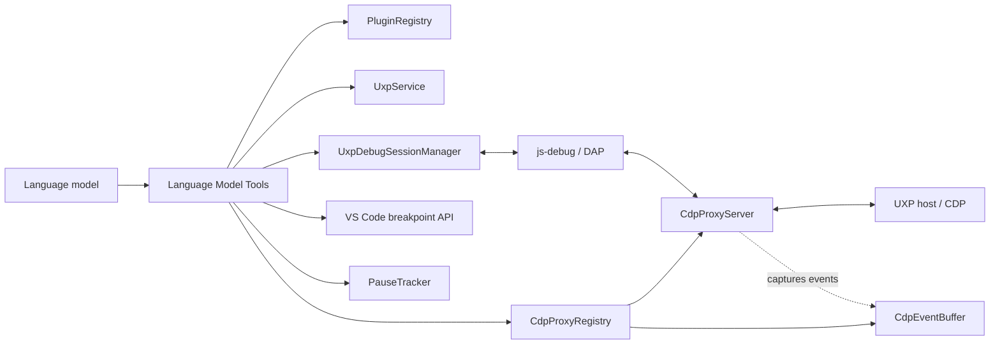

# Language Model Tools

This document describes the Language Model Tools currently exposed by the UXP
Debugger extension. It is a reference for maintainers and agent authors, not an
implementation plan.

The authoritative registration points are:

- `package.json` under `contributes.languageModelTools`: public names, descriptions,
  icons, and JSON input schemas.
- `src/vscode/tools/registerTools.ts`: runtime construction and registration.
- `src/vscode/extension.ts`: dependency wiring and extension lifecycle.

The extension currently registers 22 end-user tools. They are available in normal
production installations; there is no development-mode-only tool set.

## 1. Architecture



`registerUxpLanguageModelTools` creates one instance of every tool and registers it
with `vscode.lm.registerTool`. The same instances are exposed through the extension's
test API so live tests exercise the production dependency graph.

The tools use four principal data paths:

1. `PluginRegistry` and `UxpService` provide registered plugins, scripts, connected
   applications, installed host applications, and live plugin sessions.
2. `CdpEventBuffer` passively captures `Runtime.consoleAPICalled` and
   `Runtime.exceptionThrown` events. Each active CDP proxy has its own rolling
   in-memory buffer with a capacity of 200 console entries and 200 exception entries.
3. `PauseTracker` observes DAP events and stores the latest call-stack snapshot for
   each attached UXP client session.
4. `vscode.debug` and the active js-debug child session provide breakpoints, scopes,
   variables, frame evaluation, and resume operations.

## 2. Design decisions

### 2.1 CDP for history, DAP for paused state

Passive diagnostics use a CDP tap because DAP exposes console and exception events
only as transient, unstructured Debug Console output. The existing proxy already
sees the structured CDP events, so buffering them does not add instrumentation or
change message forwarding.

Paused frame inspection uses DAP instead of raw
`Debugger.evaluateOnCallFrame`. Raw CDP operates on compiled scopes, where bundled or
minified local names can differ from the names in authored TypeScript. js-debug
already performs source-map-aware name translation for the Variables view and Debug
Console, so the tools reuse that behavior. There is intentionally no parallel raw-CDP
frame-evaluation tool.

Global evaluation is the deliberate exception. A frameless DAP `evaluate` request
does not complete in this js-debug integration while the target is running. Therefore
`uxp_evaluate_global` sends `Runtime.evaluate` through the CDP proxy using the cached
execution-context ID.

### 2.2 One tool per debugging question

The tool set keeps historical signals, paused state, and lifecycle actions separate:

- Console and exception tools answer what happened over time and do not require a
  pause.
- Pause, variable, and frame-evaluation tools answer what is true at one suspended
  instant. Their handles expire on resume.
- Global evaluation is for reachable module/global state or programmatic
  reproduction without a breakpoint.
- Lifecycle tools load, unload, refresh, attach, detach, or launch; they do not also
  inspect runtime state.

New tools should not duplicate one of these responsibilities under a different
transport.

### 2.3 Reuse extension operations without interactive retry loops

Lifecycle tools call the same `UxpService` and `UxpDebugSessionManager` operations as
the panel and commands. They do not reproduce broker, plugin, or debugger logic.
Unlike command handlers, a tool invocation does not run an internal Quick Pick or
retry loop. Ambiguity and transient failures are returned as actionable text so the
agent can make a new, explicit call.

The UI behavior of those shared operations is documented separately in
[`CONTROL-PANEL.md`](CONTROL-PANEL.md); external build pipelines use the REST contract in
[`BUILD-TOOL-HOOKS.md`](BUILD-TOOL-HOOKS.md).

There is no separate tool for resolving a plugin name to a manifest path:
`uxp_get_debug_state` already returns plugin names, IDs, manifest paths, and session
IDs.

### 2.4 Mutations require explicit, side-effect-free preparation

Tools that write files, start applications, load or unload plugins, execute scripts,
or evaluate arbitrary expressions declare a specific confirmation message through
`prepareInvocation()`. Preparation itself must not perform side effects.

Attaching to an existing plugin session is reversible and does not require
confirmation. If attach must first load the plugin, `prepareInvocation()` detects the
absence of a live session and requests the same confirmation that an explicit load
requires. This prevents implicit load from bypassing the load policy.

### 2.5 Lifecycle scope is intentionally limited

The extension exposes fast `Plugin/reload` as `uxp_refresh_plugin`; it does not expose
the panel's heavier unload/load workflow as `uxp_reload_plugin`. Refresh preserves
debugger and inspector attachments but is not guaranteed to apply manifest changes.

When a manifest has several live sessions, unload, refresh, and detach target all of
them unless the caller supplies `sessionId`. Attach requires one unambiguous target
because it creates one debugger attachment.

Launching a host is fire-and-report. Startup and broker connection can take much
longer than a tool invocation, so `uxp_launch_host_app` does not wait for readiness or
implicitly chain into load.

### 2.6 Internal diagnostics must remain isolated

Only sanitized end-user tools are implemented and registered today. If raw broker
traces, registry internals, source-map rewrite logs, or live-test launchers are added,
they must live in a separate registration path gated by
`context.extensionMode === vscode.ExtensionMode.Development`. They must not be
reachable from a production installation.

## 3. Session identity and selection

The stable public identifier is the broker `clientSessionId`, returned as `sessionId`
by the tools. It is not the VS Code `DebugSession.id`.

js-debug creates a stamped root debug session and delegates the target to a child
session. DAP events and thread-scoped requests belong to the child. The extension
walks `parentSession` links with `findUxpClientSessionId` and stores pause state by
`clientSessionId`. `UxpDebugSessionManager.getDapSession()` returns the child when it
exists and otherwise falls back to the root.

Tools that operate on an attached debugger use these rules:

- An explicit `sessionId` must identify an attached session.
- With no `sessionId`, the sole attached session is selected automatically.
- With zero or multiple attached sessions, the tool returns an actionable message;
  it never guesses. Use `uxp_get_debug_state` to discover valid IDs.

Plugin lifecycle tools resolve live sessions by `manifestPath`:

- An explicit `sessionId` narrows the operation to that live session and must match
  the manifest.
- Without `sessionId`, unload, refresh, and detach apply to all matching sessions.
- No matching session is a valid state for load and attach; attach loads the plugin
  first when necessary.

## 4. Tool reference

### 4.1 State, validation, and packaging

| Tool | Input | Behavior | Confirmation |
| --- | --- | --- | --- |
| `uxp_get_debug_state` | none | Returns a JSON snapshot of broker state, registered plugins and scripts, live sessions, attached session IDs, and pending break-on-start sessions. | No |
| `uxp_validate_manifest` | `manifestPath: string` | Parses and validates `manifest.json` with the core manifest parser and returns either manifest details or human-readable validation errors. | No |
| `uxp_list_installed_apps` | none | Returns JSON containing the host catalog, installed versions, OS process state, and applications connected to the broker. If the native addon is unavailable, `installed` and `running` are unknown and therefore absent from the serialized entries. | No |
| `uxp_pack_plugin` | `manifestPath: string`, `outputPath: string`, `host?: string` | Validates and packages the plugin as a `.ccx`. `host` selects one target when a development manifest contains several hosts. | Always |

### 4.2 Passive runtime diagnostics

These tools read the per-session CDP event buffer and do not require a paused target.

| Tool | Input | Behavior | Confirmation |
| --- | --- | --- | --- |
| `uxp_get_console_output` | `limit?: number`, `sessionId?: string` | Returns up to the last `limit` console entries in chronological order. The default is 50. | No |
| `uxp_get_recent_exceptions` | `limit?: number`, `sessionId?: string` | Returns up to the last `limit` uncaught exceptions or rejections in chronological order. The default is 20. | No |

Console arguments are formatted from CDP `RemoteObject` values. Object previews are
limited to the value or description supplied by CDP; the tool does not recursively
inspect objects.

Source URLs, lines, and exception stacks in this buffer are raw CDP locations. They
are not rewritten through source maps. CDP line numbers are converted to one-based
display values by the output tools.

### 4.3 Breakpoints and pause control

| Tool | Input | Behavior | Confirmation |
| --- | --- | --- | --- |
| `uxp_set_breakpoint` | `filePath: string`, `line: number` | Adds a standard VS Code source breakpoint. Lines are one-based. Conditions and logpoints cannot be created by this tool. | No |
| `uxp_remove_breakpoint` | `filePath: string`, `line: number` | Removes matching standard source breakpoints, including breakpoints created manually in VS Code. | No |
| `uxp_list_breakpoints` | `filePath?: string` | Lists standard source breakpoints, optionally filtered by file, including enabled state, condition, hit condition, and log message. | No |
| `uxp_wait_for_pause` | `timeoutMs?: number`, `sessionId?: string` | Returns immediately with the current snapshot when already paused; otherwise waits for the next breakpoint or exception stop. The default timeout is 30 seconds. | No |
| `uxp_resume` | `sessionId?: string` | Sends DAP `continue` for the thread in the current pause snapshot. It does not implement step over, step into, or step out. | No |

`uxp_wait_for_pause` returns JSON with `sessionId`, `threadId`, and frames containing
`id`, `name`, optional `sourcePath`, and `line`. Frame IDs are valid only for the
current pause.

The pause tracker ignores js-debug's internal `instrumentation` stops. It clears a
snapshot on either a DAP `continued` event or a successful response to a resume
command because js-debug does not reliably emit `continued` after every such command.
Immediately after a stop, stack collection is retried up to four times with a
two-second timeout per attempt. If those attempts fail, pause-aware tools can recover
with an on-demand `threads` and `stackTrace` probe.

### 4.4 Variable inspection and evaluation

| Tool | Input | Behavior | Confirmation |
| --- | --- | --- | --- |
| `uxp_get_frame_variables` | `frameId: number`, `sessionId?: string`, `includeExpensive?: boolean`, `maxVariablesPerScope?: number` | Reads DAP scopes and top-level variables without evaluating code. Expensive scopes are excluded by default; the default per-scope limit is 200. | No |
| `uxp_get_variable_children` | `variablesReference: number`, `sessionId?: string`, `filter?: "named" \| "indexed"`, `start?: number`, `count?: number` | Reads or pages child properties through DAP. `start` defaults to 0 and `count` to 100. | No |
| `uxp_evaluate_in_frame` | `expression: string`, `frameId: number`, `sessionId?: string` | Evaluates in a paused DAP frame with js-debug's source-map-aware authored variable names. | Always |
| `uxp_evaluate_global` | `expression: string`, `sessionId?: string` | Sends CDP `Runtime.evaluate` to the cached UXP execution context. No pause is required. | Always |

`frameId` and `variablesReference` values expire as soon as execution resumes. A
caller must obtain a new pause snapshot and new references after each continue.

Global evaluation intentionally bypasses DAP. In this integration, js-debug does not
complete a frameless DAP `evaluate` request while the target is running, whereas raw
CDP evaluation against the captured `uniqueContextId` works before a pause. Both
evaluation tools require confirmation because an expression can call functions and
modify application state.

### 4.5 Scripts and plugin lifecycle

| Tool | Input | Behavior | Confirmation |
| --- | --- | --- | --- |
| `uxp_debug_script` | `scriptPath: string`, `appId?: string`, `userArgs?: unknown` | Runs a standalone `.js`, `.ts`, `.ccjs`, `.psjs`, or `.idjs` script and attaches the debugger to its new session. Missing `userArgs` becomes an empty array. | Always |
| `uxp_load_plugin` | `manifestPath: string`, `appId?: string`, `breakOnStart?: boolean` | Starts the broker if needed and loads the plugin. With `breakOnStart`, records the returned sessions as pending debugger attachment. | Always |
| `uxp_unload_plugin` | `manifestPath: string`, `sessionId?: string` | Unloads one matching live session or all matching live sessions. | Always |
| `uxp_refresh_plugin` | `manifestPath: string`, `sessionId?: string` | Sends the in-place `Plugin/reload` operation to one or all matching sessions and reports per-session failures. Existing debugger and inspector attachments remain active. | No |
| `uxp_attach_debugger` | `manifestPath: string`, `sessionId?: string`, `appId?: string` | Attaches to one live plugin session. If none exists, loads the plugin first. An already attached session is a successful no-op. | Only when the call must load the plugin first |
| `uxp_detach_debugger` | `manifestPath: string`, `sessionId?: string` | Stops debugger attachments for one or all matching plugin sessions without unloading the plugin. | No |
| `uxp_launch_host_app` | `appId: string` | Starts the newest installed compatible version of a cataloged host application. The call returns after launch and does not wait for broker connection. | Always |

`UxpService.ensureStarted()` can display the same extension UI as an interactive
command, including development-mode consent, port conflict, and broker takeover
dialogs. Tool-level errors are returned as text after one attempt; tools do not run
their own retry or Quick Pick loops. In particular:

- A host ambiguity asks the caller to retry with `appId`.
- A missing host process is not launched implicitly; call `uxp_launch_host_app`
  explicitly.
- Host request timeouts are surfaced so the caller can retry after a modal host
  dialog has been dismissed.

`uxp_refresh_plugin` is not an unload/load cycle and may not pick up manifest changes.

## 5. Confirmation policy

Confirmation is implemented by each tool's `prepareInvocation()` result. The tools
that always request confirmation are:

- `uxp_pack_plugin`
- `uxp_evaluate_in_frame`
- `uxp_evaluate_global`
- `uxp_debug_script`
- `uxp_load_plugin`
- `uxp_unload_plugin`
- `uxp_launch_host_app`

`uxp_attach_debugger` requests confirmation only when no live session exists and the
operation will implicitly load the plugin. All other tools provide no tool-level
confirmation prompt.

## 6. Typical workflows

### Inspect a paused local variable

1. Call `uxp_get_debug_state` and select the relevant `sessionId`.
2. Call `uxp_list_breakpoints`, then `uxp_set_breakpoint` if needed.
3. Call `uxp_wait_for_pause` and trigger the relevant plugin action.
4. Pass a returned frame ID to `uxp_get_frame_variables`.
5. Expand structured values with `uxp_get_variable_children`, or use
   `uxp_evaluate_in_frame` when an expression is necessary.
6. Call `uxp_resume` and remove temporary breakpoints.

### Inspect state without pausing

1. Call `uxp_get_debug_state`.
2. Read passive history with `uxp_get_console_output` or
   `uxp_get_recent_exceptions`.
3. Use `uxp_evaluate_global` only when the required state is reachable from the
   global/module execution context and the user approves evaluation.

### Start debugging a plugin

1. Use `uxp_list_installed_apps` to inspect installed, running, and connected hosts.
2. If needed, call `uxp_launch_host_app`, then re-check readiness later.
3. Call `uxp_attach_debugger`. It loads the plugin first when no live session exists.
4. Use `uxp_get_debug_state` to verify the resulting live and attached session.

## 7. Verification coverage

Pure logic is covered by the following Vitest suites:

- `test/proxy/cdpEventBuffer.test.ts`: console/exception parsing and ring-buffer
  eviction.
- `test/debug/pauseTracker.test.ts`: stored pauses, waiting, continuation,
  cancellation, and timeout behavior.
- `test/debug/uxpSessionChain.test.ts`: root/child session identity lookup.
- `test/tools/toolSessionResolution.test.ts`: attached and manifest-based session
  selection.
- `test/tools/debugStateSnapshot.test.ts`: debug-state serialization.
- `test/tools/variableInspectionTools.test.ts`: scope ordering and variable
  summaries.
- `test/tools/debugScriptTool.test.ts`: script argument forwarding.
- `test/tools/toolErrors.test.ts`: actionable load error formatting.

Live Photoshop coverage includes:

- `e2e/suite/lmToolsPauseChain.photoshop.test.ts`: breakpoint, pause, frame
  evaluation, and resume with a TypeScript source map.
- `e2e/suite/lmToolsMultiSession.photoshop.test.ts`: explicit session selection and
  ambiguity handling.
- `e2e/suite/hostAppNotRunning.photoshop.test.ts`: lifecycle tool errors when no host
  is running and invalid launch IDs.
- `e2e/suite/debugScript.photoshop.test.ts` and
  `e2e/suite/debugScriptArgs.photoshop.test.ts`: script execution and arguments.
- Existing load/unload and attach suites exercise the same `UxpService` and
  `UxpDebugSessionManager` paths used by the tools.

Run the normal local checks with:

```powershell
npm run typecheck
npm test
npm run lint
```

Live suites require the Photoshop environment described in `e2e/README.md` and are
not part of the normal unit-test command.

## 8. Not implemented

The following capabilities are not registered and have no production tool:

- Network activity capture (`uxp_get_network_activity`). The proxy does not capture
  `Network.*` events and does not enable the CDP Network domain. UXP host support has
  not been established.
- Development-only tools for raw broker traces, registry internals, source-map
  rewrite logs, or launching live E2E tests.
- Full plugin reload (`uxp_reload_plugin`) implemented as unload plus load with
  debugger/inspector restoration.
- Debugger step-over, step-into, step-out, reverse execution, or conditional/logpoint
  creation through LM tools.
- DOM or UXP Inspector queries.

## 9. Maintenance rules

When adding or removing a tool, update `package.json` and `registerTools.ts` together.
Keep schema defaults aligned with runtime defaults and add the tool to
`UxpLanguageModelTools` so the live test API uses the production instance.

Prefer pure helpers for parsing, selection, and state machines so they can be tested
without importing `vscode`. Any operation that writes files, starts applications,
loads or unloads plugins, runs user code, or evaluates arbitrary expressions must
declare an explicit confirmation message in `prepareInvocation()`.
