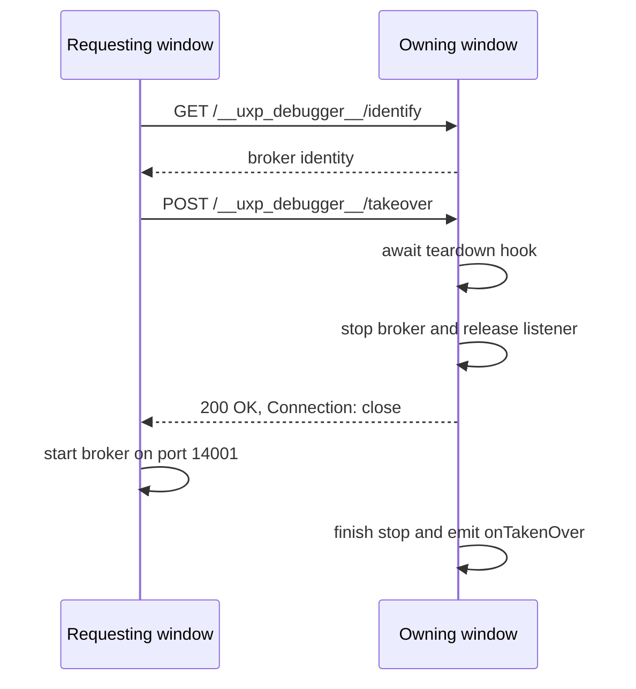

# Multi-Window Broker Ownership and Takeover

> Current-state architecture documentation. The takeover model was introduced and live-verified
> on 2026-07-30; this document reflects the implementation as of 2026-08-29.

## 1. Scope and invariant

UXP Debugger uses one fixed localhost broker port (`127.0.0.1:14001`). Exactly one VS Code
extension host may own that port and communicate with Adobe host applications at a time.

Multiple VS Code windows are supported through **exclusive ownership with explicit takeover**:

- the owning window runs the broker and owns plugin/script sessions, proxies and inspectors;
- other windows remain passive in the `ownedElsewhere` state;
- a passive window may explicitly request ownership;
- concurrent debugging from multiple windows is not supported.

The broker remains in-process in the extension host that currently owns it. There is no external
broker process, leader election, shared session registry or cross-window control plane beyond the
two localhost HTTP routes described below.

## 2. User-visible ownership states

The complete broker state model and silent-start transitions are defined in
[`APP-DISCOVERY.md`](APP-DISCOVERY.md#2-broker-state). Takeover specifically introduces the
`ownedElsewhere` outcome: silent discovery may recognize another owner, but only an explicit
panel or interactive action may request ownership from it.

The `takenOver` flag prevents a window that lost ownership from automatically trying to reacquire
it. The `stoppedByUser` flag similarly preserves an explicit stop. Both states are rendered as
full-panel blocking overlays so plugin, script and app actions cannot implicitly restart or take
over the broker.

## 3. Broker recognition and takeover protocol

Both routes are served by `UxpBroker` on the broker's existing HTTP server and are bound to
localhost only.

### 3.1 Identity probe

`GET /__uxp_debugger__/identify` returns:

```json
{
  "service": "uxp-debugger2-broker",
  "extensionVersion": "<version>",
  "pid": 12345
}
```

`probeBrokerIdentity()` validates the complete shape and returns `undefined` for timeouts,
connection failures, malformed responses and foreign services. This distinguishes another
extension window from an unrelated port owner such as Adobe UXP Developer Tools.

### 3.2 Takeover request

`POST /__uxp_debugger__/takeover` asks the current owner to release the broker. The requester uses
`requestTakeover(port, timeoutMs = 8000)`, which resolves `true` for a 2xx response and `false` for
timeouts, connection errors and non-2xx responses. It never rejects.

The owner processes the request in this order:

1. Await the injected `onBeforeTakeoverStop` hook.
2. Call `broker.stop()`. Its synchronous prefix withdraws the Vulcan announcement, closes
   tunnels/connections/WebSockets and invokes `server.close()`, so the server stops accepting new
   connections and releases the listening port.
3. Send `200 OK` with `Connection: close`.
4. Await completion of `broker.stop()` after the takeover response connection closes.
5. Emit `onTakenOver`.

The response cannot be sent after awaiting the whole `stop()` promise: `server.close()` itself
waits for the takeover HTTP connection to finish. Starting the stop first and then closing the
response avoids that deadlock while still making the port available before the requester retries
its bind. `Connection: close` also prevents HTTP keep-alive from delaying final shutdown and the
`onTakenOver` event.



## 4. Requester flows

### 4.1 Control panel

The `ownedElsewhere` overlay explains that takeover ends the other window's active debug sessions.
Clicking **Take Over** calls `UxpService.takeOverFromPanel()`.

The overlay itself is the confirmation, so this flow does not show an additional modal dialog. It
sends the takeover request and then always calls `startBrokerSilently()`. Ignoring the request's
boolean result is intentional: the real bind attempt re-derives the correct state if the previous
owner closed independently, did not answer, still owns the port, or a foreign process acquired it.

The method shares the service's `starting` promise, making repeated panel requests re-entrant and
preventing concurrent local start attempts.

### 4.2 Commands and debug entry points

Interactive operations call `UxpService.ensureStarted()`. If startup gets `EADDRINUSE`, the service
probes the port:

- a recognized extension broker opens the modal `takeoverConfirmDialog()`; confirming sends the
  takeover request and retries the same broker instance immediately;
- an unrecognized owner opens `portInUseDialog()`, which asks the user to close the conflicting
  process and retry;
- cancelling either dialog aborts the operation with `OperationCancelledError`.

If a confirmed takeover request fails, the flow falls back to the ordinary port-in-use dialog
instead of assuming ownership changed.

### 4.3 Silent activation

Automatic discovery never takes ownership away from another window and never prompts. Recognizing
another extension broker only sets `takenOver = true`, resulting in `ownedElsewhere`. Ownership can
then change only through the panel action or a later interactive operation.

## 5. Owner teardown

`extension.ts` injects the owner-side hook after constructing the service and the components that
depend on it. Before the broker releases the port, the hook:

1. closes all UXP inspector panels;
2. awaits `UxpDebugSessionManager.stopAll()`;
3. awaits `CdpProxyRegistry.stopAll()`.

`UxpDebugSessionManager.stopAll()` delegates to the existing per-session `stopSession()` path, so
delegated `pwa-node` sessions and their proxy state use the normal teardown behavior.

After shutdown completes, `UxpService` handles `onTakenOver` by setting `takenOver = true`, firing
`onBrokerStateChanged` and showing the non-modal notification:

> UXP Debugger was taken over by another VS Code window.

The same injected teardown hook is reused by the explicit **Stop UXP Debugger** command before it
stops the local broker. That path enters `stoppedByUser`, not `ownedElsewhere`.

## 6. Native adapter lifecycle

`VulcanAnnouncer` is a lazy singleton owned by `UxpService` for the lifetime of one extension-host
process. Every broker instance created after a stop or a takeover reuses the same announcer.

`UxpBroker.stop()` withdraws the current port but deliberately does **not** dispose the announcer.
Only `UxpService.dispose()` disposes it during final extension deactivation.

This ownership rule is required because Adobe's native N-API Vulcan adapter is not safe to destroy
and recreate in one process. The earlier create/stop/dispose/recreate lifecycle caused a native
extension-host crash when ownership moved A -> B -> A. Reusing one adapter per process and limiting
it to one final dispose fixed that failure and was live-verified with two VS Code windows.

`UxpBroker.stop()` is also idempotent through `stopInFlight`, and `start()` awaits an in-progress
stop before binding. This prevents a quick local restart from racing its own closing server.

## 7. Failure and recovery behavior

- A requester timeout is 8 seconds by default. The panel re-probes state through a real silent
  start; interactive callers fall back to the port-in-use dialog.
- If the owner closes or crashes, the OS releases the TCP port. A later start in another window
  becomes the owner without special recovery data.
- If the teardown hook rejects, the takeover handler currently does not send a success response or
  stop the broker. The requester times out or fails and follows its normal recovery path.
- The routes have no authentication. They listen only on `127.0.0.1`, consistent with the rest of
  the broker and build-tool hook API.
- Ownership and sessions are not transferred. The old owner's sessions are stopped; the new owner
  starts with a fresh broker state.

## 8. Implementation map

| Area | Responsibility |
| --- | --- |
| `src/core/broker/identify.ts` | Identity route constants, payload validation and probe client. |
| `src/core/broker/takeover.ts` | Takeover route constant and non-throwing POST client. |
| `src/core/broker/UxpBroker.ts` | HTTP routes, listener teardown, `onTakenOver`, `stopInFlight`. |
| `src/vscode/UxpService.ts` | Ownership state, silent/interactive/panel flows, broker and announcer lifecycle. |
| `src/vscode/extension.ts` | Teardown-hook wiring, activation auto-start and Start/Stop commands. |
| `src/vscode/ui/dialogs.ts` | Interactive takeover and foreign-port dialogs. |
| `src/vscode/panel/` | Blocking ownership overlays and panel takeover action. |

## 9. Verification status

Automated coverage currently includes:

- `test/broker/takeover.test.ts`: teardown hook ordering, immediate port reuse, `onTakenOver`, no-hook
  behavior and connection-failure handling;
- `test/broker/handshake.test.ts`: stopping withdraws the announcement without disposing the
  announcer;
- `test/panel/panelState.test.ts`: propagation of the `ownedElsewhere` panel state.

The A -> B -> A native-adapter scenario was verified manually with two real VS Code windows. The
single-instance `@vscode/test-electron` harness does not exercise the complete cross-window UI and
extension-host flow, so panel-triggered takeover and the native crash regression remain manual
integration checks.

## 10. Deliberate non-goals

- Concurrent debugging from two VS Code windows.
- Transferring live plugin, script, debugger or inspector sessions between owners.
- Running the broker as a detached external process.
- Automatically taking ownership during extension activation.
- Persisting ownership metadata or adding leader election.
