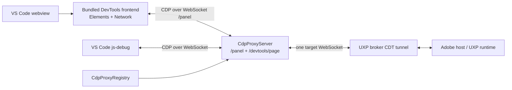

# HTML/CSS Inspector

UXP Debugger embeds a trimmed Chromium DevTools frontend in a VS Code webview. It lets
developers inspect a running plugin's DOM, view computed styles, and edit CSS declarations
without opening Adobe UXP Developer Tools.

The inspector is available from the **HTML inspector** action in the UXP Devtools sidebar or
from the `UXP: Inspect Plugin UI (HTML/CSS)` command. When more than one inspectable plugin
session is active, the command asks which session to use.

## Capabilities and limitations

- The bundled frontend contains the Elements and Network panels. Elements includes the DOM
  tree and the Styles and Computed panes.
- CSS edits affect the running plugin only. They are not written back to source files.
- The inspector works with or without an attached VS Code debugger.
- Script sessions are excluded because they have no inspectable DOM.
- A plugin paused by **Break on load** must first attach its debugger. The plugin has no
  execution context to inspect before that attachment completes.
- The inspector uses bundled static assets and does not require internet access.

## Architecture



The broker accepts only one CDT frontend connection per plugin session. Opening a second
connection replaces the first and loses the captured execution context. The inspector and
js-debug therefore never connect to the broker independently. Both acquire the same
`CdpProxyServer` from `CdpProxyRegistry`, keyed by `clientSessionId`, and the proxy owns the
session's single target WebSocket.

The registry reference-counts its consumers. Closing the inspector releases its reference;
the proxy stops only after the debugger and inspector have both released it. Concurrent
acquires and an acquire racing with shutdown are serialized so two proxies cannot compete for
the same broker session.

## Frontend hosting

The trimmed frontend is stored in `devtools-frontend-dist/` and packaged into the extension by
`scripts/bundle-devtools.mjs`. `createInspectorStaticHandler` serves those files from the
broker's existing HTTP server under `/__uxp_debugger__/inspector/`. Responses use
`Cache-Control: no-store` so replacing the frontend during development cannot leave a stale
webview cache. The handler accepts only `GET` and `HEAD` and rejects paths outside the asset
root.

`UxpInspectorPanel` creates one retained webview panel per plugin session. Its iframe loads the
local `uxp_inspector_app.html` entry point with these parameters:

- `ws=127.0.0.1:<proxy-port>/panel` connects the frontend directly to the shared CDP proxy.
- `panel=elements` selects Elements as the initial panel.

The frontend uses its native CDP WebSocket transport. No CDN, browser-version lookup, or
extension-host `postMessage` relay is involved.

## CDP multiplexing

`CdpProxyServer` distinguishes clients by WebSocket path:

- `/devtools/page/<target-id>` is the single js-debug client. Its messages pass through
  `CdpMessageRewriter` for UXP compatibility, source-map paths, breakpoint handling, and
  execution-context tracking.
- `/panel` accepts inspector clients. Panel requests bypass js-debug-specific rewriting but
  receive the compatibility and routing described below.

Panel and js-debug requests commonly start their numeric IDs at 1. Before forwarding a panel
request, the proxy replaces its ID with a value beginning at 1,000,000 and records the panel
socket and original ID. A matching response is routed only to that panel and its original ID
is restored. Target events have no request ID, so the proxy broadcasts them to all panel
clients and independently sends the js-debug-specific rewritten copy to js-debug.

The DevTools Console sends a numeric `contextId` or `executionContextId`, while UXP expects a
string `uniqueContextId`. The panel path translates these parameters using the execution
context tracked by `CdpMessageRewriter`. When a panel enables the Runtime domain after the
context was originally created, the proxy replays the cached `Runtime.executionContextCreated`
event after the `Runtime.enable` response.

## Host safety filter

Modern DevTools frontends can issue CDP calls that the older UXP runtime does not support.
Some unexpected runtime operations have previously destabilized Photoshop, so panel requests
for these method prefixes are answered locally with CDP error `-32601` and are never sent to
the host:

- `Page.startScreencast`
- `Target.*`
- `Emulation.*`
- `ServiceWorker.*`
- `Storage.*`
- `Tracing.*`

DOM, CSS, Overlay, Runtime, Debugger, Network, Page, and Log traffic is otherwise forwarded.
When adding frontend capabilities, inspect the `UXP Debugger` output channel for forwarded
methods and test new CDP domains against every supported host runtime before allowing them.

## Lifecycle

- Reopening the command reveals the existing panel for that session.
- Plugin refresh preserves the session ID, shared proxy, and inspector panel. The frontend
  repopulates when the runtime emits DOM update events.
- Full reload closes the old session's panel and can restore an inspector for the replacement
  session through the control-panel and hook workflows.
- Unloading a plugin, losing its host application, multi-window takeover, or extension
  deactivation disposes the affected panel and releases or stops its proxy.

## Verification

Unit tests under `test/proxy/` cover panel request-ID remapping, response routing, event
broadcast, denied methods, execution-context compatibility, and coexistence with js-debug.

The live Photoshop test `e2e/suite/htmlInspector.photoshop.test.ts` connects a panel client to
the shared proxy while js-debug is attached. It verifies `DOM.getDocument`, Runtime context
replay, Console evaluation, and that js-debug can still evaluate afterward. The visual webview
still requires manual QA for DOM rendering, style editing, theme changes, refresh, and reload.

When changing the bundled DevTools frontend, run:

```bash
npm run compile:devtools
npm run compile
npm test
```

The live transport test additionally requires a running Photoshop with developer mode and the
`UXP_E2E_PHOTOSHOP=1` environment variable; see `e2e/README.md` for the e2e workflow.