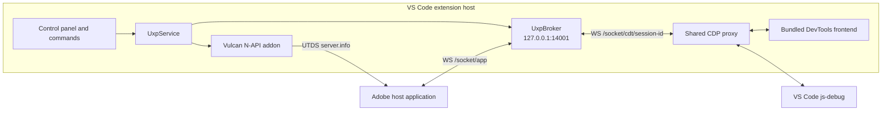

# UXP Debugger Architecture and Implementation Record

> This document records what the migration ultimately delivered. It replaces the original
> decision document and phased plan. The current implementation is the source of truth; the
> measured experiments, host bugs, failed approaches, and compatibility constraints are retained
> here because they explain several otherwise surprising design choices.

## 1. Final result

UXP Debugger is a desktop VS Code extension that replaces Adobe UXP Developer Tools for the
implemented development workflows. It runs a UDT-compatible HTTP/WebSocket broker directly in
the VS Code extension host, announces that broker through Adobe Vulcan IPC, manages plugin and
script sessions, and connects VS Code's JavaScript debugger and a bundled Chromium DevTools
frontend to the host application's CDP stream.

The migration chose **Strategy A: the broker and native Vulcan addon run in the extension host**.
There is no service child process and no `/socket/cli` client layer.



The implementation is split at a deliberate boundary:

| Layer | Implemented responsibility |
| --- | --- |
| `src/core/` | VS Code-independent protocol types, broker, sessions, CDT tunnel, manifest matching, package creation, developer-mode detection, and native Vulcan wrappers |
| `src/vscode/` | Broker lifecycle, VS Code commands and UI, debug adapter delegation, CDP compatibility proxy, inspector, watch mode, HTTP hooks, output channels, and language-model tools |
| `native/` | Extracted per-platform N-API addon and Adobe runtime libraries, copied as package assets rather than bundled as JavaScript |
| `devtools-frontend-dist/` | Trimmed Chromium DevTools frontend used by the HTML/CSS inspector |

### 1.1 Migration scope

The migration removed every runtime dependency on Adobe UXP Developer Tools. Users need an Adobe
host application, but not the UDT desktop application, the `uxp` CLI, an `app.asar` patch, or a
`.uxprc` file. The following legacy mechanisms were removed rather than adapted:

- `.uxprc` endpoint discovery;
- `.debug.json` fixed-port probing;
- the `app.asar` patch command and documentation;
- target-history-driven attach, replaced by the persistent registry plus broker-owned live
  sessions.

The first implementation milestone intentionally covered broker ownership, plugin registry and
lifecycle commands, debugger attach, script debugging, developer-mode enablement, and actionable
host-not-running errors. Host launch, watch mode, Break on load, packaging, build hooks, the
HTML/CSS inspector, TypeScript scripts, multi-window takeover, and language-model tools were added
after that baseline without changing the core transport.

### 1.2 Decision record

This table retains the choices that shaped the implementation, including proposal decisions that
were revised after testing against real hosts.

| Area | Final decision | Reason and evidence |
| --- | --- | --- |
| Vulcan integration | Load the N-API addon in the extension host (Strategy A) | It worked end to end in the real VS Code utility process. This avoids a helper-process protocol and lifecycle. The VS Code-independent `src/core/` boundary preserves a future child-process escape hatch if ABI compatibility changes. |
| Broker | Clean TypeScript implementation using `ws` | The protocol surface is small and typed. Adobe's implementation remains a reference rather than a runtime dependency; no Express or Lodash layer is needed. |
| Layering | `src/core/**` must not import `vscode` | Broker, protocol, manifest, packaging, and native wrappers remain testable in plain Node and reusable outside VS Code. `UxpService` is the integration boundary. |
| Port and coexistence | Own fixed port `14001`; hand over only between recognized UXP Debugger windows | Adobe hosts learn this port through Vulcan. An unknown listener, including UDT, cannot be adopted safely and remains an error. A recognized extension instance supports graceful takeover. |
| `/socket/cli` | Do not implement it | UDT needed a client socket because its CLI and service were separate processes. Extension commands call the broker in process. |
| CDT boundary | Keep `/socket/cdt/<clientSessionId>` as a loopback WebSocket | The existing proxy already consumed that shape, and one uniform CDP surface supports js-debug, the inspector, and future clients without coupling them to broker internals. |
| Developer mode | Detect by direct file read; enable only after explicit consent through Adobe's elevated scripts | Reading needs no privilege. Writing the machine-wide setting does, so the UI states the path before invoking the OS elevation prompt and verifies the result afterwards. |
| Registry | Store absolute plugin and script paths in `globalState`, outside Settings Sync | Entries must work across workspaces on the same machine, while machine-specific paths must not roam to other machines. |
| Sessions after host restart | Do not restore automatically | This matches UDT 2.2.1 and avoids reconstructing fragile hidden host state. Users reload explicitly. |
| Multiple matching hosts | Ask for one target instead of proposal-era fan-out | A deterministic target makes failures, session ownership, debugger restoration, and UI state understandable. |
| Host validation | Local validation plus authoritative `Plugin/load`; disable `Plugin/validate` in the VS Code integration | Real hosts did not answer validation reliably and could wedge subsequent traffic. The reusable core keeps optional best-effort validation for other embedders. |
| Native lifetime | One addon and one instance of each Vulcan adapter per extension-host process | Recreating an adapter after disposal was observed to crash the extension host. Stop withdraws the announcement; only final deactivation disposes native objects. |

### 1.3 Why the architecture keeps two network hops

The proxy connects to the in-process broker over loopback instead of receiving an internal stream.
That is deliberate: the broker exposes one UDT-compatible CDT contract, while the shared proxy
owns UXP-to-CDP compatibility, source-map rewriting, debugger state, and multiplexing. The extra
local hop keeps host protocol routing independent from every frontend and allowed the inspector to
reuse the same path later.

## 2. Broker and Vulcan lifecycle

### 2.1 Startup and ownership

`UxpService` owns the in-process broker and separates non-interactive activation discovery from
explicit operations that may request consent or show recovery UI. Startup behavior, Developer
Mode, broker states, application discovery, and host launch are documented in
[`APP-DISCOVERY.md`](APP-DISCOVERY.md). Exclusive ownership of fixed port `14001` and the
cross-window handoff protocol are documented in
[`MULTI-WINDOW-TAKEOVER.md`](MULTI-WINDOW-TAKEOVER.md).

### 2.2 Native addon packaging

The extension loads the Adobe addon by an absolute path computed from `process.platform` and
`process.arch`. Supported package targets are:

| Target | Files loaded or required beside the addon |
| --- | --- |
| `win32-x64` | `node-napi.node`, `AID.dll`, `VulcanControl.dll`, `VulcanMessage5.dll` |
| `darwin-x64` | `node-napi.node`, `AID.dylib`, `VulcanControl.dylib`, `VulcanMessage5.dylib` |
| `darwin-arm64` | `node-napi.node`, `AID.dylib`, `VulcanControl.dylib`, `VulcanMessage5.dylib` |

The native archives are extracted at build time by `npm run prepare-native`. A VSIX installation
does not run an npm postinstall hook, so the final package must already contain these files.
`electron-napi.node` is deliberately not shipped.

The loader does not use `node-gyp-build` directory discovery. Its `build/Release` lookup picks the
alphabetically first `.node` file and does not reliably distinguish runtime tags when both
`electron-napi.node` and `node-napi.node` are present. Directly requiring the one known
`node-napi.node` path removes that ambiguity.

### 2.3 Announcement behavior

`VulcanAnnouncer` creates `VulcanAdapter("UTDS", "1.0.0")` lazily and sends:

```js
setServerDetails(true, JSON.stringify({ port: 14001 }));
```

The host then connects to `ws://127.0.0.1:14001/socket/app`. On normal stop the extension sends
the matching `false` state and disconnects the adapter only during final extension disposal.

Announcements are treated as state transitions, not idempotent beacons. Before reporting that no
matching host is connected, the service waits passively for `500 ms`. It re-announces once only
when **no host application at all** connected, then waits another `500 ms`. It does not toggle
`false -> true` as a refresh mechanism.

The same native module also exposes a separate `VulcanControlAdapter`, created lazily for installed
application discovery and host-app launch. Photoshop, InDesign, and Premiere Pro are represented
by the current host catalog. Both adapters follow a one-instance-per-process lifetime rule.

## 3. Implemented protocol behavior

The broker exposes these routes on the same HTTP server:

| Route | Behavior |
| --- | --- |
| WebSocket `/socket/app` | Adobe host connection, `initRuntimeClient`/`App/info` handshake, plugin and script request/reply traffic, host logs |
| WebSocket `/socket/cdt/<clientSessionId>` | One CDT/CDP tunnel for a live plugin or script session |
| `GET /json/version` | Compatibility bootstrap response |
| `GET /__uxp_debugger__/identify` | Identifies this extension's broker to another VS Code window |
| `POST /__uxp_debugger__/takeover` | Graceful multi-window ownership handoff |
| `/__uxp_debugger__/hooks/*` | Build-tool REST integration |
| `/__uxp_debugger__/inspector/*` | Locally served DevTools frontend assets |

`AppConnection` correlates request IDs, applies Adobe-compatible operation timeouts, drops late
replies after timeout, and turns host log notifications into per-application output channels.
Session registration is driven by successful load/runScript replies and host-side unload or
disconnect notifications. The broker also keeps a `500 ms` minimum gap between a completed
`App/info` handshake and the first plugin operation, avoiding the host's initialisation window.

The extension performs local manifest parsing and required-field validation. It deliberately
constructs the VS Code broker with `validateBeforeLoad: false`: no observed host answers
`Plugin/validate`, and Photoshop 27.8/UXP 9.3 was observed silently dropping related plugin
traffic during lifecycle testing. `Plugin/load` remains authoritative for host-side failures.
The reusable core broker retains optional best-effort `Plugin/validate` behavior for other
embedders.

If a manifest matches more than one connected application and no target is pinned, the extension
asks the user to choose one. It does **not** automatically load into every matching app. Once a
target is selected, load succeeds only after that application returns success. Reload, refresh,
unload, debugger restoration, and inspector restoration operate on the resulting live sessions.

Sandboxed/UWP hosts are detected and rejected. The UDT sandbox-copy workflow was not ported.

### 3.1 Host handshake

The application connection follows the Adobe protocol in this order:

```text
host connects /socket/app -> broker sends {"command":"ready"}
host sends {"command":"initRuntimeClient"}
broker sends {"command":"App","action":"info","requestId":n}
host replies with appId, appVersion, appName, uxpVersion, platform,
  sandbox, and optional supportedFeatures
broker registers the app and emits the apps-changed event
```

`supportedFeatures` gates capabilities such as script debugging. A socket is not treated as an
available application until `App/info` completes, and the broker waits at least `500 ms` after
that reply before its first plugin operation because some hosts report readiness before their
plugin command queue is usable.

### 3.2 Requests, replies, and timeouts

Each `AppConnection` owns a request map keyed by `requestId`. A pending entry contains its
resolver, rejecter, operation name, and timer. Late replies are discarded after timeout instead of
being associated with a newer request.

| Operation | Timeout |
| --- | --- |
| `App/info` | `5000 ms` |
| `Plugin/load`, `Plugin/reload`, `Plugin/runScript` | `5000 ms` |
| `Plugin/list` | `1500 ms` |

Timeout messages retain the operation name and tell the user to check whether the host is busy or
showing a modal dialog. `Plugin/validate` is the exception described in the decision record: the
VS Code integration does not send it.

### 3.3 Session identity and CDT framing

Sessions have two identifiers. The **host session ID** comes from `Plugin/load` or
`Plugin/runScript` and is used in messages to Adobe. The **client session ID** is generated by the
broker, appears in `/socket/cdt/<clientSessionId>`, and remains the extension-facing identity
during reload. Keeping these identities separate also leaves room for rebinding a stable client
identity if a host-specific reload fallback ever needs a new host ID.

Plugin sessions retain their manifest path and plugin ID. Script sessions are pseudo-plugins with
an identity derived from `__uxpScript:<fileName>`. A host `UXP/unloaded` event removes the session,
closes its CDT target, and propagates teardown to the debugger and inspector. Closing the app
socket ends every session owned by that connection. `UXP/log` events are routed to the host's
output channel.

When a frontend connects, the tunnel sends `Plugin/cdtConnected` to the host. Frontend CDP frames
are wrapped as:

```json
{"command":"CDT","pluginSessionId":"<host-id>","cdtMessage":"<raw-cdp-frame>"}
```

Host frames are unwrapped in the reverse direction, and disconnect sends
`Plugin/cdtDisconnected`. The host permits one CDT connection per session, which is why all
extension-owned consumers share `CdpProxyRegistry` rather than opening independent target sockets.

## 4. User-facing functionality

The user-facing surface is intentionally documented by entry point rather than repeated here:

- [`APP-DISCOVERY.md`](APP-DISCOVERY.md) owns host discovery, status, and launch.
- [`CONTROL-PANEL.md`](CONTROL-PANEL.md) owns the sidebar, registry, plugin and script actions,
  persistence, Watch behavior, packaging UI, and panel architecture.
- [`BUILD-TOOL-HOOKS.md`](BUILD-TOOL-HOOKS.md) owns the localhost REST integration for external
  build pipelines.

Command Palette and `launch.json` entry points reuse the same underlying services.

## 5. Debugger and inspector

### 5.1 JavaScript debugging

The extension contributes `uxp` attach and `uxp-script` launch configurations. It delegates the
debug UI and DAP implementation to VS Code's built-in js-debug (`pwa-node`) and inserts a local
CDP proxy between js-debug and the broker's CDT socket.

The proxy adapts UXP behavior expected neither by stock Chromium nor Node debugging:

- rewrites inline and external source maps to absolute local source paths;
- translates execution-context IDs and selected `Runtime.evaluate` requests;
- handles unsupported worker calls and other protocol differences;
- buffers console output and recent exceptions for language-model tools;
- preserves the apparent debug session across short execution-context destruction/recreation on
  plugin refresh;
- reconnects and restores debugger state around full plugin reloads.

Break on load uses a V8 instrumentation breakpoint
`beforeScriptWithSourceMapExecution`, coordinated by the proxy and js-debug's
`pauseForSourceMap`. The proxy arms it before resuming the UXP target, suppresses irrelevant early
pauses, and lets js-debug reuse the armed breakpoint ID. The investigation and rejected approaches
remain in [`BREAK-ON-START.md`](BREAK-ON-START.md).

### 5.2 HTML/CSS inspector

The inspector is the second consumer of the shared CDP proxy shown in the top-level diagram. Its
capabilities, multiplexing, host-safety filter, lifecycle, limitations, and verification are
documented in [`UI-DEBUGGING.md`](UI-DEBUGGING.md), which is authoritative for this subsystem.

## 6. Language-model tools

The complete tool reference, transport choices, confirmation policy, session selection, workflows,
verification, and maintenance rules are documented in
[`LANGUAGE-MODEL-TOOLS.md`](LANGUAGE-MODEL-TOOLS.md), which is authoritative for this subsystem.

## 7. Measured feasibility evidence retained from migration

### 7.1 Vulcan is required

Measured **2026-07-24**, Windows, Photoshop 27.9.0, Node 24.8.0, with developer mode already
enabled:

| Experiment | Observation |
| --- | --- |
| Bare WebSocket server on `127.0.0.1:14001`, Photoshop restarted, waited over four minutes | No connection and no TCP attempt from Photoshop |
| Same server followed by `VulcanAdapter("UTDS", "1.0.0").setServerDetails(true, '{"port":14001}')` | Connection in under one second to `/socket/app`, then `{"command":"initRuntimeClient","platform":"win32"}` |

The host used `User-Agent: WebSocket++/0.8.2`. The prebuilt addon loaded in stock Node 24 and
`getAppsList()` returned `PS,27.9.0,Adobe Photoshop`. An already-running Photoshop reacted to the
announcement; no restart was required.

### 7.2 The addon works in the real extension host

Measured **2026-07-25** in a real VS Code extension-host utility process:

| Item | Result |
| --- | --- |
| VS Code / Electron / Node | VS Code 1.130.0, Electron 42.6.0, Node 24.18.0 |
| ABI | modules 146, N-API 10 |
| Native load | `node-napi.node` loaded without rebuild or npm install |
| Vulcan APIs | `VulcanAdapter` constructed, app list read, announcement returned successfully |
| End-to-end | Real Photoshop connected to `/socket/app` and sent `initRuntimeClient` |

This established Strategy A on `win32-x64`. The darwin x64/arm64 assets were subsequently
verified live on macOS Intel and Apple silicon extension hosts with a real host application.

## 8. Bugs, quirks, and constraints

### 8.1 Fixed host lifecycle wedge: duplicate announcements

**Observed 2026-07-27 on Photoshop 27.8 / UXP 9.3.** When Photoshop was already running, the
broker announced itself and the load path immediately announced again before the first connection
completed. The socket connected and answered `App/info`, but every subsequent `Plugin/*` request
was silently dropped. Retries did not recover the connection, and Photoshop could remain as a
lingering process after its UI closed.

The decisive fix was to wait passively before the one last-resort re-announcement. A tested
`false -> true` Vulcan toggle was reverted because the `false` leg actively disconnects hosts. A
handshake settle delay and skipping `Plugin/validate` did not fix the double-announce defect;
validation remains skipped because it supplies no observed value. Full hypotheses, falsifications,
and field logs are retained in [`LIFECYCLE-NOTES.md`](plans/LIFECYCLE-NOTES.md).

### 8.2 Native adapter re-creation crashes the extension host

The process-lifetime native-adapter invariant was established by live takeover-back testing. Its
failure mode, ownership rule, and verified lifecycle are documented in
[`MULTI-WINDOW-TAKEOVER.md`](MULTI-WINDOW-TAKEOVER.md#6-native-adapter-lifecycle).

### 8.3 Host validation is not dependable

No tested host returned a useful `Plugin/validate` response. Some versions ignore it; Photoshop
27.8/UXP 9.3 was also investigated for a possible queue wedge after the unanswered request. The
VS Code implementation skips host validation and relies on local manifest checks plus the actual
`Plugin/load` result. This differs intentionally from Adobe UDT-compatible core defaults.

Adobe UDT 2.2.1 does not make this operation dependable. Its client performs a shallow local
manifest check first, selects one compatible connected application, and sends that application a
`Plugin/validate` request before every `Plugin/load`. The service forwards the validation request
without an operation timeout. Consequently, a host that ignores the request can leave UDT's load
flow waiting indefinitely; only an explicit `{ success: false }` reply produces a validation
failure. UDT's packaging path has a limited fallback: when no compatible host is connected, it
warns that strict validation requires a running host and packages using local checks, but it does
not solve an unanswered request from a connected host.

UDT's separate host-launch checks do not strengthen plugin validation. The native helper checks
whether a configured SAP code is installed and whether one of its discovered versions meets the
catalog minimum before calling `launchApp`. A successful launch result does not wait for an
`App/info` handshake or prove that the launched host is connected and ready for plugin traffic.
The VS Code implementation therefore treats broker handshake state as connection evidence and the
actual `Plugin/load` reply as the authoritative host-side result.

### 8.4 Single target connection

The one-target invariant is defined with CDT framing in section 3.3; inspector multiplexing and
the external-client limitation are documented in [`UI-DEBUGGING.md`](UI-DEBUGGING.md).

### 8.5 Remaining platform and runtime constraints

- Only desktop `win32-x64`, `darwin-x64`, and `darwin-arm64` are packaged. Linux and VS Code web
  extensions are unsupported.
- A remote/SSH extension host is useful only if the Adobe application and Vulcan libraries run on
  that same remote machine.
- Sandboxed/UWP host applications are rejected; sandbox copy/path rewriting is not implemented.
- Adobe UDT cannot run concurrently because it normally owns port `14001`; unlike another UXP
  Debugger window, it cannot participate in the takeover protocol.
- Newly installed host-app versions may not appear until VS Code is restarted because native
  installed-app discovery is cached for the process lifetime.
- Photoshop stable/beta SAP codes were confirmed from a real Vulcan specifier dump; the current
  InDesign and Premiere Pro beta SAP codes are educated but unverified catalog entries. When more
  than one channel/version is installed, launch selects the numerically newest candidate even when
  that candidate is a beta build.
- Type-stripped TypeScript support is limited to one erasable script file; TypeScript plugins and
  imported module graphs require a bundler.
- Watch mode is dormant while a plugin is unloaded or a script debugger is detached.
- Inspector CSS edits are in-memory only.
- Full visual inspector behavior still requires manual QA even though transport and routing have
  automated coverage.

### 8.6 Localhost trust model

Host, CDT, takeover, static-inspector, and build-hook endpoints have no session-token
authentication. They bind only to `127.0.0.1`, matching the inherited Adobe design, but any local
process can reach them. The host endpoint cannot be tokenized without changing Adobe applications.

### 8.7 Operational error model

Core failures are typed and contain no UI dependency. The VS Code layer maps them to dialogs,
notifications, panel states, and output-channel detail. Retry is offered only where repeating the
same operation can plausibly succeed.

| Situation | Detection | User-facing behavior |
| --- | --- | --- |
| Port `14001` belongs to another UXP Debugger window | identify endpoint succeeds | Show ownership state and offer graceful takeover. |
| Port `14001` belongs to UDT or an unknown process | listen returns `EADDRINUSE`; identify fails | Ask the user to close the owner and retry. |
| Developer mode disabled | settings file read | Explain the privileged write and request consent; keep broker stopped on decline/failure. |
| Native addon unavailable | unsupported target, missing file, or load failure | Report platform details; leave the broker stopped. |
| Required host not connected | no matching app after passive wait and, only if no apps exist, one re-announcement | Name the required application and offer Retry/Cancel. |
| Host operation times out | request timer | Name the operation and include the busy/modal-dialog hint. |
| `Plugin/load` fails | host reply has `success: false` | Surface the host's error text; the failed app creates no session. |
| Plugin unloads in the host UI | `UXP/unloaded` | End the session, debugger, inspector, proxy references, and active watcher; notify the user. |
| Application disconnects | app WebSocket closes | End all sessions owned by that app and tear down their clients. |
| Registered file is missing | filesystem check at resolution time | Warn and offer removal from the registry. |
| Host is sandboxed/UWP | `App/info.sandbox` | Keep it visible, but reject unsupported plugin operations clearly. |
| Script restart meets a tearing-down run | host says it "is modal" | Retry up to ten times at `500 ms`; return every other host error immediately. |

### 8.8 Deferred or deliberately unsupported work

- Sandboxed/UWP copy and path rewriting remain unimplemented.
- Adopting an existing Adobe UDT broker through `/socket/cli` remains possible in principle but
  conflicts with the simpler single-owner model and has no current implementation.
- Session recovery after an Adobe host restart remains intentionally manual.
- External DevTools clients cannot share a session safely because they bypass the extension's CDP
  multiplexer.

## 9. Verification status

The repository validates the implementation at three levels:

- Vitest unit/integration tests cover protocol framing, fake host applications, lifecycle,
  manifest handling, packing, proxy rewriting, inspector multiplexing, hooks, panel state, watch
  decisions, and tools.
- The VS Code extension-development E2E suite covers activation and command/debug integration.
- Optional Photoshop E2E tests exercise real load/unload/reload, scripts, source maps,
  break-on-start, inspector coexistence, tools, hooks, takeover, and lifecycle behavior when
  `UXP_E2E_PHOTOSHOP=1` is enabled.

Normal local validation commands are:

```bash
npm run typecheck
npm test
npm run lint
npm run compile
```

The vendored/reference trees (`uxp-cli-v1/`, `uxp-UDT-v2/`, and `vscode-edge-devtools/`) are not
part of the extension's runtime implementation.
