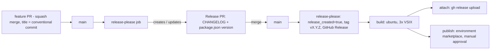

# Plan: release pipeline (GitHub Actions + release-please + VS Marketplace)

Status: **plan. Bootstrap (section 6) is done; no workflow files exist in the repo yet** (earlier drafts were discarded).

Revision 2 (2026-10-02): verified against the repo, the Marketplace and the `vsce` sources. Changes from revision 1 are marked **[rev2]**.

## 1. Goals

- CI on every PR and every push to `main` (typecheck, lint, unit tests, VSIX build).
- Automatic changelog and version bump from Conventional Commits (release-please).
- A release is the merge of a release PR. It produces a tag and a GitHub Release with the changelog and the `.vsix` files attached.
- Publishing to the VS Marketplace after manual approval (GitHub Environment `marketplace`).
- Marketplace authentication through a mechanism that stays supported (OIDC, see 4.1), not through a PAT, which is being retired.
- Open VSX: **not for now** (can be added later as a single step).

## 2. Current repository state (verified)

| Topic | State |
| --- | --- |
| Version | `origin/main` = `7010a90`, `package.json` `2.0.2`, publisher `JaroslavBereza`, name `uxpdebugger`. Marketplace shows 2.0.2 (updated 29 Sep 2026). **[rev2]** |
| Git tags / releases | `v2.0.2` -> `7010a90` (HEAD of `main`), `v2.0.0` -> `69cb763`, plus `v0.1.0`, `v0.2.0`. GitHub Releases exist for all; release 2.0.2 has the 3 VSIX attached. **[rev2]** |
| Platform VSIX | `npm run build` -> `scripts/package-platforms.mjs` -> 3 packages (`win32-x64`, `darwin-x64`, `darwin-arm64`) in `installers/` |
| Native binaries | `native/**` is committed; only `devtools-scripts/mac.sh` and `win32.bat` are in Git LFS (`.gitattributes`) -> every checkout needs `lfs: true`. Both are stored with mode `100644`; `mac.sh` is invoked as `sh <mac.sh>` via `osascript`, so no executable bit is needed. **[rev2]** |
| `vscode:prepublish` | `npm run prepare-native && npm run compile`; `prepare-native` reads `uxp-cli-v1/`, which is in `.gitignore` -> **fails in CI** |
| `CHANGELOG.md` | hand-written, sections `## [2.0.0]`, `## [1.0.0] – date`; 2.0.1 and 2.0.2 are missing |
| `@vscode/vsce` | repo pins `^3.9.2`; **4.0.0 is released** (Node 22 baseline). `main` also contains a hidden `--oidc` trusted-publishing option (see 4.1). **[rev2]** |
| Workflow files | none (`.github/` does not exist) |
| Local branch | `dev3` (`26c0632`) is stale: squash-merged into `main` as `7010a90`, `origin/dev3` deleted. Switch to `main` and delete `dev3` (`git branch -D`). **[rev2]** |

## 3. Architecture

Key decision: build and publish live in the **same workflow** as release-please and are gated on its `release_created` output. A tag created with `GITHUB_TOKEN` does not trigger other workflows, so a separate workflow on `push: tags` would never run.

**[rev2]** The `build` job checks out `steps.rp.outputs.sha`, not `tag_name`. This is more robust and is required if `draft: true` is ever enabled (a draft release does not create the tag).

## 4. Decisions

### 4.1 Marketplace authentication **[rev2: three options]**

All options produce the credential that `vsce publish` sends to the Marketplace; they differ in how it is obtained.

| | A. GitHub OIDC trusted publishing (`vsce publish --oidc`) | B. Entra ID (`--azure-credential`) | C. PAT (`VSCE_PAT`) |
| --- | --- | --- | --- |
| How it works | `vsce` requests a GitHub Actions OIDC token (audience `marketplace.visualstudio.com`) and exchanges it at `marketplace.visualstudio.com/_apis/gallery/token` for a short-lived credential. No Azure involved. | `azure/login` (OIDC) logs in the Azure CLI; `vsce` acquires an Entra token via `ChainedTokenCredential` (`EnvironmentCredential`, `AzureCliCredential`, ...). | Long-lived token with scope "All accessible organizations" = exactly the **global PAT** type. |
| Status | In `vsce` `main` since PR #1291 (Jul 2026), **hidden** from `--help` (#1297), last changed 3 days ago (#1337, pre-release 4.0.1-1). Undocumented; Marketplace-side trusted-publisher configuration unknown. | Documented by Microsoft for Azure Pipelines only; the GitHub variant follows from the `vsce` source and must be tried. | Works today. |
| Future | Intended successor; not GA yet. | Supported. | **Stops working on 1 Dec 2026.** |
| Secrets in GitHub | none | none (`AZURE_CLIENT_ID`, `AZURE_TENANT_ID` as vars) | one long-lived secret |
| Setup effort | lowest (`id-token: write` + one flag) | highest: Entra tenant, identity, federated credential, publisher membership. Risky for an individual publisher on a personal Microsoft account. | low |

**Decision:** in phase 4 try the options in the order A -> B -> C.
- A is the cheapest to test (one workflow run with `permissions: id-token: write` and `vsce publish --oidc`). If the Marketplace rejects the exchange (trusted publisher not configurable yet), fall back to B.
- B details: identity added as Contributor on publisher `JaroslavBereza`; federated credential subject `repo:jardicc/vscode-uxp-debugger:environment:marketplace`, issuer `https://token.actions.githubusercontent.com`; `azure/login` with `allow-no-subscriptions: true` if the identity has no subscription; `AZURE_TENANT_ID` exported so `vsce` picks the right tenant.
- C only as a stop-gap and only until 1 Dec 2026. Re-check A before every release until it is GA.
- Use `@vscode/vsce@4` (or a 4.0.1 pre-release while testing A).

### 4.2 Token for release-please (running CI on the release PR)

CI should run automatically on the release PR, but must not be a required check (free tier).

- A PR created with `GITHUB_TOKEN` does not trigger CI. Solution: a fine-grained PAT (or GitHub App) passed to release-please as `token:`.
- **Decision:** fine-grained PAT scoped to this repository only, permissions `Contents: write`, `Pull requests: write` and `Issues: write` **[rev2]** (release-please tracks state through the labels `autorelease: pending` / `autorelease: tagged`, which go through the Issues API; labeling must not be skipped), stored as the secret `RELEASE_PLEASE_TOKEN`. In `release.yml`: `token: ${{ secrets.RELEASE_PLEASE_TOKEN || github.token }}`, so the pipeline still works without it (just without CI on the release PR). The job also declares `permissions: contents: write, pull-requests: write, issues: write` for the `github.token` fallback.
- Put the PAT expiry date in a calendar. A GitHub App is a more robust alternative but more work.
- Do **not** configure branch protection with required CI checks.

### 4.3 Squash merge and Conventional Commits

release-please reads commits on `main` and derives the version and changelog content from their prefixes:

- `fix: ...` -> patch, `feat: ...` -> minor, `feat!: ...` or a `BREAKING CHANGE:` footer -> major.
- `chore:`, `docs:`, `refactor:`, `test:`, `ci:` do not appear in the changelog by default.

With **squash merge**, all commits in a PR are combined into one commit whose message is (depending on settings) the **PR title**. So only the PR title needs to follow the convention (e.g. `feat: add break-on-start toggle`); individual commits inside the PR do not matter.

Repository setting: Settings -> General -> Pull Requests -> allow squash merging with "Default to pull request title", disable the other merge types. Commits without a prefix are ignored by release-please (nothing breaks, they just do not appear in the changelog).

## 5. Repository changes

### 5.1 `package.json`
- Change `vscode:prepublish` to `npm run compile` (without `prepare-native`). `prepare-native` stays as a manual script for when the native binaries are updated.
- Note: `createVSIX` runs prepublish for every target, so `compile` runs 3 times. This works, just slower. Optimizing it (single compile + `--no-prepublish`) is out of scope.

### 5.2 `.github/workflows/ci.yml` (new)
- Triggers: `push` to `main`, `pull_request`, `workflow_dispatch`. `concurrency` per ref with `cancel-in-progress: true`. `timeout-minutes` on jobs.
- `verify` (windows-latest): checkout with LFS, Node 22, `npm ci`, `typecheck`, `lint`, `test`. Windows because the unit tests load the `win32-x64` native addon.
- `package` (ubuntu-latest): `npm run build`, upload the `vsix` artifact (`if-no-files-found: error`). **[rev2]** Linux is a precaution, not a requirement: `vsce` drops POSIX modes on Windows, but nothing in the package depends on them (`mac.sh` is run through `sh`, native libraries are `dlopen`ed). Kept on Linux anyway; it is also cheaper.
- Before the first run: confirm `npm ci` succeeds from a clean clone (lockfile in sync). Not verified yet. **[rev2]**
- E2E (`npm run test:e2e`) is out of scope for this plan; later a separate workflow (`workflow_dispatch` + `windows-latest`).

### 5.3 `.github/workflows/release.yml` (new)
Trigger: `push` to `main`. `concurrency: release`, `cancel-in-progress: false`. Jobs: `release-please` -> `build` -> (`attach` and `publish` in parallel).

1. `release-please` (ubuntu): `googleapis/release-please-action@v4` with `token: ${{ secrets.RELEASE_PLEASE_TOKEN || github.token }}`, `config-file`, `manifest-file`; job permissions `contents: write`, `pull-requests: write`, `issues: write` **[rev2]**. Outputs: `release_created`, `tag_name`, `sha`.
2. `build` (ubuntu, `if: release_created == 'true'`): checkout `ref: sha` **[rev2]** with LFS, `npm ci`, `npm run build`, upload artifact `vsix`. Re-running `typecheck`/`test` here is optional (already green in CI on the same commit); drop them to save minutes.
3. `attach` (ubuntu, `contents: write`): download artifact, `gh release upload "$TAG" installers/*.vsix --clobber`.
4. `publish` (ubuntu, `environment: marketplace`, `permissions: id-token: write, contents: read`): download artifact, Node 22, then **one** of the following, selected per 4.1 **[rev2]**:
   - A: `npx @vscode/vsce@4 publish --oidc --skip-duplicate --packagePath installers/*.vsix`
   - B: `azure/login@v2` (client-id, tenant-id, `allow-no-subscriptions: true`) + `vsce publish --azure-credential --skip-duplicate --packagePath ...` with `AZURE_TENANT_ID` in `env`.
   - C: `vsce publish --skip-duplicate --packagePath ...` with `VSCE_PAT` in `env`.
   `--skip-duplicate` makes re-runs idempotent: three VSIX are published sequentially, and without it a retry after a partial failure would stop at the first already-published target. **[rev2]**
5. **[rev2]** `secrets.*` is not available in `if:` expressions. A runtime switch between A/B/C must map the secret into `env` and test `env.VSCE_PAT != ''` at step level. Simpler: keep only the active option in the file and change it when switching.
6. `attach` does not wait for `publish`: the VSIX files are attached to the GitHub Release even if the Marketplace approval is rejected. Accepted.

### 5.4 `release-please-config.json` (new)
- `release-type: node`, `package-name: uxpdebugger`, `changelog-path: CHANGELOG.md`, `include-component-in-tag: false` (tags `vX.Y.Z`, matching the existing `v2.0.2`).
- Add `changelog-sections` (visible: feat, fix, perf, refactor, docs; hidden: chore, test, ci, build) and `pull-request-title-pattern`, e.g. `chore: release ${version}`.
- Verify that the bump also covers `package-lock.json` (the `node` strategy updates it; check in the first release PR).

### 5.5 `.release-please-manifest.json` (new)
- `{ ".": "2.0.2" }`. Matches `package.json` on `main`, tag `v2.0.2` and the Marketplace. **[rev2: verified]**

### 5.6 `.github/dependabot.yml` (new)
- Add `commit-message.prefix: "chore(deps)"` (`chore(deps-dev)` for dev dependencies) so commits follow Conventional Commits and do not fail the PR title check.
- Optionally add `groups` for minor/patch updates to reduce the number of PRs.

### 5.7 `.github/workflows/pr-title.yml` (new)
- `amannn/action-semantic-pull-request@v5` on `pull_request` (`opened`, `edited`, `synchronize`), permission `pull-requests: read`. **[rev2]** Do not use `pull_request_target`; it is unnecessary here and widens the attack surface.
- Not a required check (see 4.2); it serves as a warning.

### 5.8 Optional: take `mac.sh` / `win32.bat` out of Git LFS **[rev2]**
- Two small text files in LFS force `lfs: true` on every checkout, consume LFS bandwidth quota and break forks/`npx`-style clones without LFS. `git lfs untrack 'native/**/*.sh' 'native/**/*.bat'`, remove the lines from `.gitattributes`, re-add the files, commit. Afterwards `lfs: true` can be dropped from the workflows.
- Not required for the pipeline; do it only if the owner agrees.

## 6. release-please bootstrap **[rev2: DONE]**

Done by the owner on 2026-10-02: `dev3` squash-merged into `main` (`7010a90`, PR #8), tags `v2.0.0` and `v2.0.2` created on `main` history, GitHub Releases 2.0.0 and 2.0.2 created, release 2.0.2 has the 3 VSIX attached. Verified with `git fetch --tags` and the Releases page.

Consequences:
- release-please will search commits from `v2.0.2` onward. Since that tag is the HEAD of `main`, the first release PR appears only after the next `feat:`/`fix:` commit lands. This is expected.
- No `bootstrap-sha` needed.
- Optionally add 2.0.1/2.0.2 sections to `CHANGELOG.md` by hand; release-please inserts new sections above the existing content.

## 7. GitHub and cloud settings (manual)

1. Settings -> Actions -> General -> enable "Allow GitHub Actions to create and approve pull requests".
2. Settings -> Environments -> `marketplace`: required reviewer = repository owner; restrict to branch `main`.
3. Secrets: `RELEASE_PLEASE_TOKEN` (repository secret; fine-grained, Contents/Pull requests/Issues write, expiry in calendar); only for option C: `VSCE_PAT` (environment secret in `marketplace`).
4. Only for option B: vars `AZURE_CLIENT_ID`, `AZURE_TENANT_ID` on environment `marketplace`.
5. Settings -> General -> Pull Requests: squash merge, "Default to pull request title".
6. Only for option B: create the identity in Entra, add the federated credential (subject in 4.1), add the identity as Contributor on publisher `JaroslavBereza` at https://marketplace.visualstudio.com/manage.
7. Only for option A: check the publisher management page for a trusted-publishing / OIDC section and register `jardicc/vscode-uxp-debugger` (environment `marketplace`) if available. **[rev2]**

## 8. Implementation phases

| Phase | Content | Done when |
| --- | --- | --- |
| 0. Local cleanup **[rev2]** | `git switch main`, `git pull`, `git branch -D dev3` | working tree on `main` = `7010a90` |
| 1. Repo preparation | 5.1, 5.2, 5.6, 5.7, (5.8 optional), settings from section 7 (items 1, 2, 5) | CI is green on a PR, the `vsix` artifact contains 3 VSIX files |
| 2. Bootstrap | ~~section 6~~ done; add 5.4, 5.5 | release-please config committed; no PR opened yet (nothing to release) |
| 3. Release without publishing | 5.3 with the `publish` job present but the `marketplace` approval rejected | after a `fix:`/`feat:` commit and merge of the release PR: tag, GitHub Release and the 3 attached VSIX files |
| 4. Marketplace auth | 4.1 in order A -> B -> C, section 7 items 3/4/6/7 as needed | `publish` job authenticates (verify with `vsce verify-pat --azure-credential` where supported, or by publishing a patch version) |
| 5. First real release | release PR -> merge -> approve `marketplace` | the new version is visible on the Marketplace for all 3 platforms |
| 6. Cleanup | remove any PAT fallback, document the commit convention in README/CONTRIBUTING, bump `@vscode/vsce` devDependency to `^4` | no long-lived Marketplace token remains |

## 9. Risks and mitigations

- **OIDC trusted publishing (A) is undocumented and still changing** -> test it in an isolated run; B and C are fallbacks. **[rev2]**
- **Entra (B) needs an Entra tenant and a publisher linked to it** -> may be impractical for a personal Microsoft account; discover early in phase 4. **[rev2]**
- **PAT (C) is the retired global PAT type** (`vsce` requires "All accessible organizations") -> hard deadline 1 Dec 2026. **[rev2]**
- **`prepare-native` in CI** -> fixed by 5.1; without it the build fails.
- **LFS pointers inside the VSIX** -> `lfs: true` in every checkout (or 5.8); after the build, check the size of `mac.sh`/`win32.bat` inside the VSIX.
- **Partial Marketplace publish** (1 of 3 targets fails) -> `--skip-duplicate` makes the re-run idempotent. **[rev2]**
- **Wrong tag/version** -> bootstrap verified; before merging the first release PR, review the diff of `package.json` and `package-lock.json`.
- **Marketplace does not support semver pre-release tags** (only `major.minor.patch`) -> do not handle pre-releases for now.
- **A published Marketplace version number cannot be reused** -> publish only after approval; publishing cannot be undone (only unpublish / delete the version).
- **`RELEASE_PLEASE_TOKEN` expiry** -> calendar reminder; the pipeline still works thanks to `|| github.token`.

## 10. Out of scope

- Open VSX (later: an `ovsx publish` step per VSIX).
- E2E tests in CI.
- Pre-release channel.
- macOS binary signing.
